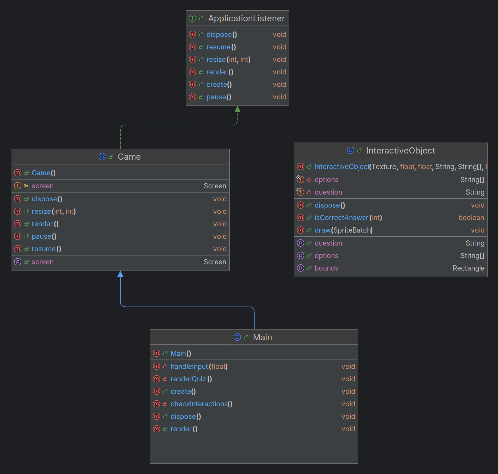

# Quizzossauro 🦖

## Sobre o Jogo
**Quizzossauro** é um jogo interativo no qual o jogador deve responder perguntas relacionadas a paleontologia, geografia e cultura local. O objetivo é explorar o cenário enquanto aprende e testa seus conhecimentos, avançando por meio de interações com objetos no ambiente.

---

## Autoria
**Nome:** Pedro Henrique G. Abreu  
**Curso:** Sistemas de Informação - Universidade Federal de Santa Maria (UFSM)

---

## Comentários sobre o Processo de Desenvolvimento
### Planejamento e Ideia
O desenvolvimento do jogo começou com a ideia de criar um quiz associado com as demandas do trabalho. A escolha do dinossauro como personagem foi inspirada no Geoparque Quarta Colônia.

### Tecnologias Utilizadas
- **Linguagem:** Java
- **Framework:** LibGDX
- **IDE:** IntelliJ IDEA / VSCode
- **Controle de Versão:** Git e GitHub

### Desafios Encontrados
1. **Centralização e Renderização de Textos:** 
   Trabalhar com a renderização dinâmica de perguntas e opções foi um desafio. Soluções como o uso de `GlyphLayout` para medir o texto foram implementadas.
2. **Interação com Objetos:**
   Foi necessário criar um sistema de colisão eficiente usando `Rectangle` para detectar interações.
3. **Gerenciamento de Estados do Jogo:**
   A transição entre o estado de exploração e o modo de quiz exigiu uma boa organização do código e foi onde mais encontrei dificuldade.
   

   ### Referencias:
   ## Conteúdos usados para o desenvolvimento do jogo:
   - Material da disciplina: https://github.com/andreaInfUFSM/elc117-2024b)
   - Documentação da LibGDX: https://libgdx.com/dev/
   - Welsiton Ferreira - Desenvolvedor Indie: https://www.youtube.com/playlist?list=PLwlysxDPhB-9uWQBnjGenhONQXS6gzvOp
   - ChatGpt (para consulta de alguns erros e bugs, maioria relacionado a função "build:dist")
   - Terminal Root: https://www.youtube.com/watch?v=2bmvlwvnirk
   - Brent Aureli Codes: https://www.youtube.com/playlist?list=PLZm85UZQLd2SXQzsF-a0-pPF6IWDDdrXt

   ## Inspirações e informações das perguntas e respostas do quiz:
   - GeoParque Quarta Colônia: https://www.geoparquequartacolonia.com.br/home
   - GeoParque Caçapava: https://geoparquecacapava.com.br/
   - Distrito Criativo Centro-Gare: http://www.distritocentrogare.com.br/index.php/pt/
   - Jardim Botânico da UFSM: https://www.ufsm.br/orgaos-suplementares/jardim-botanico
